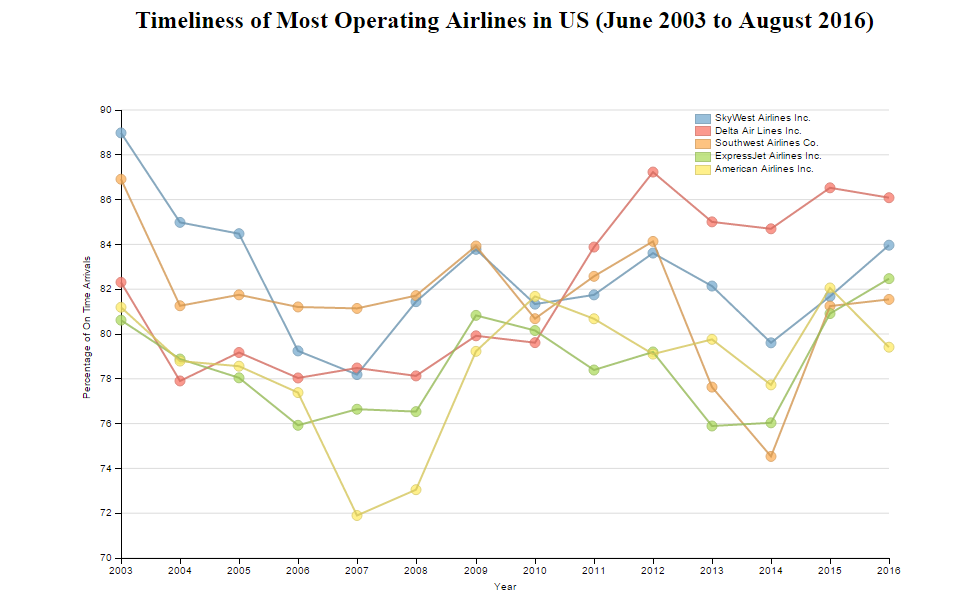
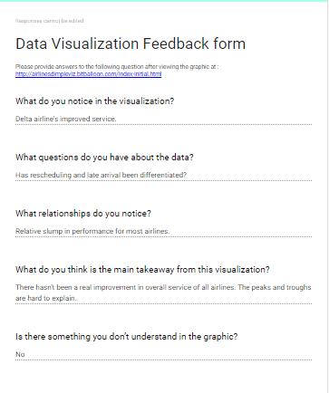
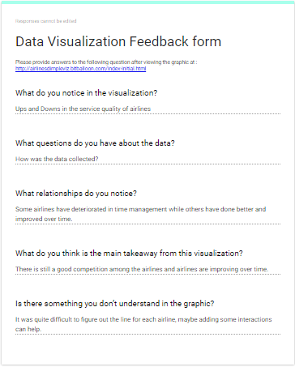
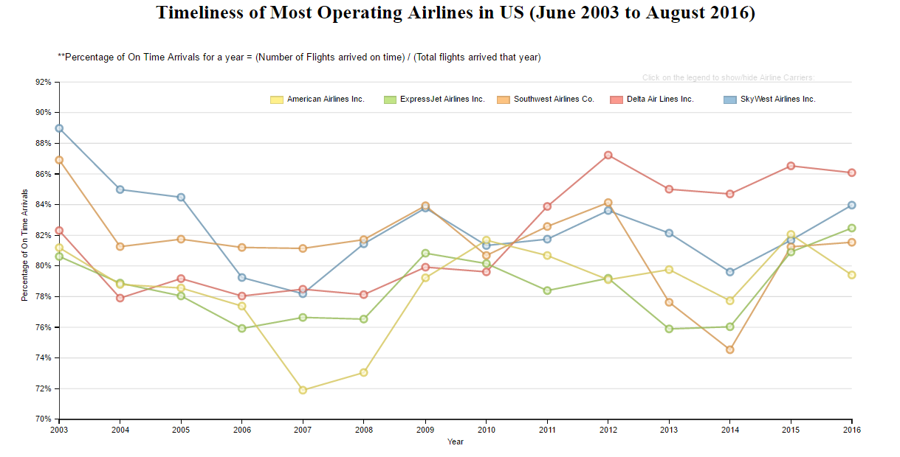

# Data Visualization Project : Performance of most operating Airlines in U.S (2003 - 2016)

> by Joy Lal Chattaraj

***View the visualization <a href = "http://airlinesdimpleviz.bitballoon.com/"> here </a>***

## Description

> The data shows how airlines have performed the years 2003-2016. It shows the percentage of top 5 carrier's flights that were on time (within 15 minutes of sheduled time) for each year. Source of data : <a href = "http://www.transtats.bts.gov/OT_Delay/OT_DelayCause1.asp?pn=1">RITA</a>

## Design

>The Initial data cleaning was performed using RStudio. The code is mentioned in `data/data_cleaning.r` The original data `airlines_data.csv` had a size of 37MB. This was too large to load on a web-browser over internet. So, I decided to perform some EDA and decide what to plot for the final visualizations. I drew pair plots, scatter plots and histograms to look at the data. Finally I decided to show how various airlines have performed over the years in terms of timely arrivals.

> The data was still large. Plotting about 30 airlines was not possible at once. I would hamper the visual and make it unreadable. So, I decided to filter out the airlines those have the most arrivals on an average over the years. Thus, the data was reduced to few kilobytes and and had details about the top 5 airlines. 

### Visualization using dimple.js and d3.js

## Feedback

> I created a google form that was mentioned on the visualization page. These are the best responses I received :

### Feedback 1

### Feedback 2

### Feedback 3

### Post-feedback design

> I change the following features.
>* 1. Added an info on how on time arrivals were calculated
>* 2. Added Interaction : user can select whic airlines to view by clicking on the legend
>* 3. Added Interaction : the line for each carrier highlights on hover, makes it easier to clearly view each line.
>* 4. Edited the scale on y axis so that most of the graph is utilized to represent the data

> I belive rest of the questions were not possible to answer using this graphic as it's aim isn't related to those questions or adding more details may takeup more space and make the visual a bit messy.

### References

* 1. Udacity data visualization course
* 2. stackoverflow.com
* 3. RITA - The source of data
* 4. d3 and dimple.js documentation
* 5. <a href = "http://dimplejs.org/advanced_examples_viewer.html?id=advanced_interactive_legends">Building interactive legends</a>
